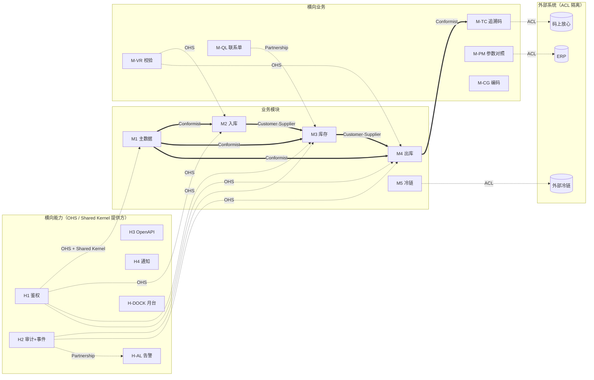

# ADR-0012：限界上下文（Bounded Context）与 Context Map

- 状态：Accepted
- 决策日期：2026-05-18
- 决策人：项目主人
- 关联：ADR-0001 / ADR-0002 / ADR-0007 / ADR-0008 / docs/architecture-dependencies.md

---

## 背景

软件设计审计 §4 维度 3 识别 DDD 战略层完全空白：

- 模块清单（H1-H10 + H-DOCK + H-AL + 12 M- 横向 + 5 M 业务 = **24 个上下文**）已是事实上的限界上下文
- 但**没有显式声明**：每个 BC 的责任、语言模型、与其他 BC 的集成模式
- 8 种 DDD 集成模式（Customer-Supplier / Conformist / Anti-Corruption Layer / Open Host Service / Published Language / Shared Kernel / Partnership / Separate Ways）选用哪种没文档化

不解决会导致：
- 模块间 API 设计无统一指导（什么时候用同步 RPC vs 异步事件？）
- 新人难理解模块边界
- 共享 type（OwnerId / BatchNo）跨 BC 时无规范
- 微服务拆分时手忙脚乱（虽然当前 monolith）

---

## 候选方案

### 方案 A（推荐）：完整 Context Map + 8 种集成模式声明

每个 BC 在自己的 module-manifest.toml 声明：
- 责任范围
- 语言模型（关键术语）
- 与其他 BC 的集成模式（8 选 1）

治理脚本 `check_bounded_contexts.py` 校验：
- BC 在架构图、manifest、字段词典三处一致
- 集成模式声明合法
- Shared Kernel 字段集合限定

### 方案 B：仅写 ADR 不强制 manifest 声明

**否决理由**：会重蹈"ADR 写完没落地"覆辙（ADR-0008 经验教训）。

### 方案 C：先做 Context Map 一张图，后期补声明

**否决理由**：图与代码 / manifest 易脱节，无法治理脚本校验。

---

## 决策

**采用方案 A：每个 BC 显式声明 + 治理脚本校验**。

### 24 个限界上下文清单

按 ADR-0007 + architecture-dependencies §1：

#### 横向能力（12 BC）
| 编号 | BC | 责任 | 语言模型核心 |
|---|---|---|---|
| H1 | 鉴权与多租户 | 用户/角色/权限/货主隔离 | User / Role / Permission / Tenant / Owner |
| H2 | 审计与事件总线 | 审计追踪 + 事件发布订阅 | AuditEntry / Event / Subscription / DLQ |
| H3 | OpenAPI 契约 | 跨端 API 类型同步 | Schema / Endpoint / Version |
| H4 | 企微通知 | 消息发送通道 | Notification / Channel / Template |
| H5 | 快递面单 | 配送方路由 | Carrier / Waybill / DeliveryRoute |
| H6 | 状态机引擎 | 跨模块状态机统一 | State / Transition / Trigger |
| H7 | 导入导出引擎 | Excel/CSV 数据交换 | ImportTask / ExportTask / Mapping |
| H8 | ERP 防腐层 | WMS↔ERP 接口适配 | ErpDoc / SyncStatus / Mapping |
| H9 | 打印模板引擎 | 单据/标签模板 | Template / PrintJob / RetryQueue |
| H10 | 备份恢复 | 全量+WAL+异地 | Backup / Restore / Snapshot |
| H-DOCK | 月台预约管理 | 预约调度 + 实到对账 | Dock / Appointment / TimeWindow |
| H-AL | 告警引擎 | 告警分级/升级/路由 | Alert / EscalationRule / Severity |

#### 业务模块（5 BC）
| 编号 | BC | 责任 |
|---|---|---|
| M1 | 主数据 | 商品/客户/供应商/仓库/库位档案 |
| M2 | 入库 | ASN / 收货 / 验收 / 上架 |
| M3 | 库存 | 实时库存 / 批次效期 / 状态管理 / 养护 / 盘点 / 移库 |
| M4 | 出库 | 订单 / 波次 / 拣选 / 复核 / 发货 / 退货 |
| M5 | 冷链数据集成 | 接收外部冷链事件 |
| M6 | 报表与审计追踪 | GSP 法定台账 |
| M8 | 连锁药店 | 门店补货 / 越库 / O2O |
| M9 | 3PL 计费 | 仓储费 / 作业费 / 月结 |
| M10 | TMS+ | 运输协同 |

> 注：M5/M6/M8/M9/M10 实际是业务模块但已被纳入 5 BC 内（M5/M6 是横向叠加，M8/M9/M10 是增值业务）。

#### 横向业务能力（12 BC）
| 编号 | BC | 责任 |
|---|---|---|
| M-TE | 任务引擎 | 任务流转 |
| M-RP | 补货 | 自动补货 |
| M-PK | 包装站 | 零拣复核 / 电子秤 |
| M-VR | 校验规则 | 规则引擎 |
| M-QL | 质量联系单 | 质量审批流 |
| M-CG | 编码生成 | 序列管理 |
| M-SA | 报损报溢 | 销毁台账 |
| M-RC | 对账 | ERP 对账 |
| M-DI | 药检单 | 药检报告 |
| M-BA | 批号调整 | 批号修正 |
| M-PM | 参数对照 | ERP 字段映射 |
| M-TC | 追溯码 | GS1 + 监管上报 |

**总计 24 个 BC**（10 H + 2 H 新 + 12 M-）。M 业务模块未列入 BC 是因为它们是**业务流程**而非**能力上下文**，由 BC 协作完成。

---

### 8 种集成模式速查

| 模式 | 含义 | wms 案例 |
|---|---|---|
| Customer-Supplier | 上游主导但下游能影响优先级 | M2 ⇨ M3（M2 调 M3 写库存）|
| Conformist | 下游被动接受上游模型 | M3 ⇒ M4（M4 用 M3 的库存模型）|
| Anti-Corruption Layer (ACL) | 防腐层隔离外部模型 | H8（WMS ⊥ ERP）/ M-PM（参数对照）|
| Open Host Service (OHS) | 公开 API 给多个下游用 | H1 / H3 / H6 等横向能力 |
| Published Language | 共享语言模型（schema） | OpenAPI / 字段词典 §6 |
| Shared Kernel | 共享代码（双方维护）| 跨 BC 共享 type（OwnerId / BatchNo）|
| Partnership | 双向紧密协作 | H2 ⇄ H-AL（事件总线 ⇄ 告警引擎）|
| Separate Ways | 互不依赖 | M5 冷链 ⇏ M9 计费 |

---

### Shared Kernel 清单（v3.1 强制）

**跨 BC 共享的 type 必须在 Shared Kernel**，不允许散落各 BC：

| Shared Kernel Type | 来源 | 跨 BC 使用 |
|---|---|---|
| `OwnerId` | H1 货主隔离 | 所有业务 BC |
| `TenantId` | H1 租户 | 所有业务 BC |
| `WarehouseId` | M1 主数据 | M2/M3/M4/H-DOCK |
| `ProductCode` | M1 主数据 | M2/M3/M4/M-TC/M-PM |
| `BatchNo` | M3 库存 | M2/M4/M-TC/M-DI |
| `ApprovalSource` | H2 审计 | M3/M-RC/M-QL/M-SA/M5 |
| `OperatorId` | H1 鉴权 | 所有写操作 |
| `TraceId` | H2 事件 | 所有 API 调用 |
| `ErrorCode` | ADR-0010 字典 | 所有 API 错误 |

**禁止**：业务 BC 自定义同名 type（如 M3 自己定义 `OwnerId` ⊥ H1 的 `OwnerId`）。

---

### Context Map（关系图）



---

### BC 之间集成模式声明（在 module-manifest.toml）

**示例**（M-TC 月台预约 manifest 增强）：

```toml
[bounded_context]
code = "M-TC"
name = "追溯码模块"
language_model = ["TraceCode", "Nomenclature", "GTIN", "RegulatoryReport"]

[integrations]
# 与每个有依赖关系的 BC 声明集成模式
M1 = "Conformist"          # M-TC 接受 M1 的商品定义
M3 = "Customer-Supplier"   # M-TC 调 M3 写状态变更（碰追溯码）
M_CG = "OHS"              # M-TC 通过 M-CG 取追溯码序号
H1 = "OHS"                # 通过 H1 鉴权
H2 = "OHS"                # 通过 H2 审计
"码上放心" = "ACL"         # 防腐层隔离外部监管平台

[shared_kernel]
provides = []              # 本 BC 不向外提供共享类型
consumes = ["OwnerId", "TenantId", "ProductCode", "BatchNo", "OperatorId", "TraceId", "ErrorCode"]
```

---

## 后果

### 正面

- **架构清晰**：所有 BC + 集成模式 + Shared Kernel 写在一处，新人 30 分钟可理解
- **代码组织指引**：每个 crate 对应一个 BC，跨 BC 通过明示的集成方式调用（不允许"潜行调用"）
- **微服务可拆分**：未来要拆分时，按 BC 边界即可（Shared Kernel 提取为独立 crate）
- **治理可机器校验**：BC 一致性 + Shared Kernel 合规可脚本扫描

### 负面

- **学习成本**：DDD 战略概念对部分团队陌生，初期 1-2 周培训
- **manifest 维护成本**：每个 BC 加 [bounded_context] + [integrations] 段（约 20 行）
- **重构压力**：Wave 1 实施时如发现集成模式选错，需要回头改

### 风险

- **过度抽象**：BC 划分太细 → 24 个微服务式约束让单 monolith 笨重
- **应对**：明示"BC 是设计概念，不必须对应代码 crate；多 BC 可在同一 crate 内通过 module 隔离"
- **集成模式误用**：把 Conformist 当 OHS 用 → 上游变化时下游灾难
- **应对**：治理脚本扫描跨 BC 调用，校验是否符合声明的集成模式

---

## 实施约束

1. 所有 24 个 BC 必须在 Wave 0 末期补 module-manifest.toml 的 [bounded_context] + [integrations] 段
2. Shared Kernel 类型集合（9 个）固定，新增需 ADR
3. 业务 BC 不允许定义与 Shared Kernel 同名的 type
4. 跨 BC 调用必须经声明的集成模式（治理脚本校验）
5. M-PM / H8 是 ACL 的实施载体，不允许业务 BC 直接对接外部系统

---

## 治理脚本

`scripts/governance/check_bounded_contexts.py`（T1 级）：
- 扫描 24 个 BC 的 module-manifest.toml
- 校验每个 BC 必有 [bounded_context] + [integrations] 段
- 校验集成模式在 8 种白名单内
- 校验 Shared Kernel 类型在 9 个白名单内
- 校验跨 BC 依赖图的双向一致性（A 声明依赖 B 时，B 也应承认 A）

---

## 参考

- Eric Evans, Domain-Driven Design (2003): Bounded Context, Context Map
- Vaughn Vernon, Implementing Domain-Driven Design (2013): 集成模式
- Vaughn Vernon, Domain-Driven Design Distilled (2016): Shared Kernel 实践

## 变更记录

| 日期 | 版本 | 变更 |
|------|------|------|
| 2026-05-18 | v1 | 初版：24 个 BC 声明 + 8 种集成模式 + Shared Kernel 9 类 + Context Map + 治理脚本约束 |
