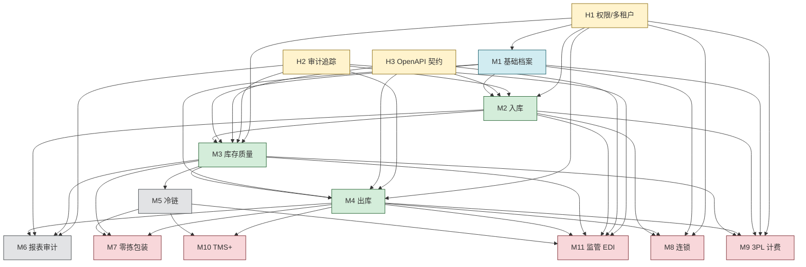

# wms 架构依赖图（Architecture Dependencies）

> 本文档是 wms 项目模块依赖关系的**唯一真相源**。
> ROADMAP 的波次划分、ADR-0004 的执行顺序、worktree 并行决策，都基于本文档。
> 修改本文档必须经过 PR，并同步检查是否需要更新 ADR-0004 与 ROADMAP.md。

- 版本：v0.1
- 日期：2026-05-15
- 关联：`docs/governance.md`、`docs/adr/0004-phase-roadmap.md`、`ROADMAP.md`

---

## 1. 模块清单

### 1.1 横向能力（H 层，所有业务模块的基础设施）

| 编号 | 横向能力 | 简称 | 说明 |
|-----|---------|------|------|
| H1 | 权限与多租户（货主隔离） | auth-tenant | 所有 API 鉴权；多货主数据隔离 |
| H2 | 审计追踪基础设施 | audit-trail | append-only 审计；GSP 不可篡改要求 |
| H3 | 跨端契约（OpenAPI + utoipa） | contract | 后端生成 OpenAPI；前端类型同步 |

### 1.2 业务模块（M 层）

| 编号 | 模块 | 简称 |
|-----|------|------|
| M1 | 基础信息与资质档案 | master-data |
| M2 | 采购入库作业（PDA 集成） | inbound |
| M3 | 库存与质量管控 | inventory |
| M4 | 销售出库作业 | outbound |
| M5 | 冷链基础管控 | cold-chain |
| M6 | 报表与审计追踪 | audit-report |
| M7 | 零拣复核包装站 | picking-pack |
| M8 | 连锁药店专有 | retail-chain |
| M9 | 3PL 计费管理 | billing |
| M10 | 高级物流与运输协同 | tms-plus |
| M11 | 监管平台一键对接 | regulatory-edi |

---

## 2. 全景依赖图



---

## 3. 分层视图

```
┌─────────────────────────────────────────────────────────────┐
│ 第 0 层：横向能力（业务模块的基础设施）                     │
│   H1 权限/多租户   H2 审计追踪   H3 OpenAPI 契约           │
└─────────────────────────────────────────────────────────────┘
                              ↓
┌─────────────────────────────────────────────────────────────┐
│ 第 1 层：业务底座                                           │
│   M1 基础档案（商品/供应商/客户/仓库/库位）                 │
└─────────────────────────────────────────────────────────────┘
                              ↓
┌─────────────────────────────────────────────────────────────┐
│ 第 2 层：核心业务流程（线性依赖：入→存→出）                │
│   M2 入库  →  M3 库存质量  →  M4 出库                       │
└─────────────────────────────────────────────────────────────┘
                              ↓
┌─────────────────────────────────────────────────────────────┐
│ 第 3 层：横向叠加能力                                       │
│   M5 冷链（叠加在 M3）   M6 报表审计（贯穿 M2/M3/M4）      │
└─────────────────────────────────────────────────────────────┘
                              ↓
┌─────────────────────────────────────────────────────────────┐
│ 第 4 层：增值业务                                           │
│   M7 零拣包装   M8 连锁   M9 3PL 计费                       │
│   M10 TMS+      M11 监管 EDI                                │
└─────────────────────────────────────────────────────────────┘
```

---

## 4. 关键依赖说明

### 4.1 横向能力（H 层）必须先行的理由

| 能力 | 为什么必须先做 |
|-----|----------------|
| H1 权限/多租户 | 后期补租户化 = 改所有表 + 所有查询，是灾难 |
| H2 审计追踪 | 后期补审计 = 历史数据无法追加审计痕迹，违反 GSP |
| H3 OpenAPI 契约 | 后期补 = 前后端类型已分裂，迁移成本高 |

**结论**：H1 / H2 / H3 必须**最先做**，且不能延后。

### 4.2 业务底座（M1）的渐进性

商品没有就没有库存、入库、出库——**M1 是绝对前置**。
但 M1 内部可以**渐进扩展**，不必一次到位：

- **M1.a** 基础属性（编码、名称、规格） → 立刻能用
- **M1.b** 资质有效期校验 → 入库（M2）时才需要
- **M1.c** UDI / 监管码 → 监管对接（M11）时才需要

### 4.3 核心业务流程（M2 → M3 → M4）

强依赖关系，**schema 必须按顺序稳定**：
- M2 入库写 schema 后，M3 才知道怎么读批次
- M3 库存模型定下来后，M4 才能扣减库存

但 **M2 / M3 / M4 的"前端页面"和"PDA 端"可以并行**（schema 定了之后）。

### 4.4 横向叠加（M5 / M6）

| 模块 | 真实依赖 | 并行性 |
|-----|---------|--------|
| M5 冷链 | M3 库存（按温区控制）+ M2 收货（到货温度） | 必须等 M3 稳定 |
| M6 报表审计 | H2 审计基础设施 + 各业务模块写入审计表 | **可与 M2/M3/M4 并行**（消费方角色，不阻塞业务） |

### 4.5 增值模块（M7-M11）

| 模块 | 业务依赖 | 外部依赖（非技术）|
|------|----------|-------------------|
| M7 零拣包装 | M3 + M4 + M5 | 电子秤 / 蓝牙打印机硬件 |
| M8 连锁 | M1 + M4 + H1 | 门店主数据 |
| M9 3PL 计费 | M2/M3/M4 流水 + H1 | 合同条款约定 |
| M10 TMS+ | M4 + M5 | 车辆 GPS 设备、电子地图 API |
| M11 监管 EDI | M2/M3/M4 + M5 | **药监局接口资质 / "码上放心"账号** |

### 4.6 M11 的特殊提示

**M11 监管 EDI 有外部资质流程，可能比代码开发耗时更长**。建议在 H 层启动时就**并行启动外部资质申请**：
- 药监局接口资质申请
- "码上放心"账号开通
- 与监管对接的技术联系人确认

外部流程不在 git 工作流内，但要在 ROADMAP / TODO 中显式追踪。

---

## 5. 波次（Wave）划分

按依赖图，将 11 个模块 + 3 个横向能力分为 **5 个波次**。每波之内可用 worktree 并行；每波之间存在严格依赖。

### Wave 0：治理骨架（已完成或进行中）

不属于业务模块，但必须先于一切代码：
- 项目结构、Git、文档、ADR、治理脚本骨架

### Wave 1：横向底座（H 层）

| 编号 | 任务 | 可并行（worktree）|
|-----|------|------|
| W1.A | H1 权限/多租户基础 | ✅ |
| W1.B | H2 审计追踪基础设施 | ✅ |
| W1.C | H3 OpenAPI 契约工具链（utoipa + gen-api） | ✅ |

H1 / H2 / H3 三者完全独立，可同时进行。**Wave 1 完成是后续所有业务模块的前置条件。**

### Wave 2：业务底座 + schema 先行

| 编号 | 任务 | 依赖 | 可并行 |
|-----|------|------|--------|
| W2.A | M1.a 基础档案 schema + 基础 CRUD | H1, H3 | ✅ |
| W2.B | M2 入库 schema 设计（不写业务规则） | H1, H2 | ✅ |
| W2.C | M6 报表查询接口骨架 | H2 | ✅ |

3 个 worktree 并行；约定好"商品 ID / 批次 ID"类型契约即可。

### Wave 3：核心业务规则铺开

| 编号 | 任务 | 依赖 |
|-----|------|------|
| W3.A | M2 入库业务规则 + handler + PDA 端 | W2.A, W2.B |
| W3.B | M3 库存模型 + 业务规则 | W2.A, W2.B |
| W3.C | M5 冷链 schema 设计 | 独立（不依赖 M3 业务规则）|
| W3.D | M9 3PL 计费"账户/合同"模型 | H1（独立）|

### Wave 4：完整闭环 + 横向叠加

| 编号 | 任务 | 依赖 |
|-----|------|------|
| W4.A | M4 出库（订单/拣选/复核/打印） | W3.B |
| W4.B | M5 冷链业务规则 | W3.B, W3.C |
| W4.C | M6 报表实现（消费各业务流水） | W3.A, W3.B, W4.A |
| W4.D | M11 监管 EDI 适配层骨架（**外部资质并行推进**）| W3.A, W3.B |

### Wave 5：增值模块全面铺开

| 编号 | 任务 | 依赖 |
|-----|------|------|
| W5.A | M7 零拣包装 | W3.B, W4.A, W4.B |
| W5.B | M8 连锁专有 | W2.A, W4.A |
| W5.C | M9 3PL 计费业务规则 | W3.A, W3.B, W4.A, W3.D |
| W5.D | M10 TMS+ | W4.A, W4.B |
| W5.E | M11 监管 EDI 业务对接 | W3.A, W3.B, W4.A, W4.B + 外部资质 |

**注意**：Wave 5 理论上 5 个 worktree 可同时并行。**实际个人节奏建议最多 3 个并行**，避免认知负荷过载。

---

## 6. 并行约束规则（worktree 落地）

1. **同 Wave 内允许并行**：依据上表 W*.A / W*.B / W*.C 的标记
2. **跨 Wave 不允许并行**：低 Wave 未完成时，高 Wave 不得启动
3. **个人 worktree 上限 = 3**（含 main）
4. **schema 变更必须串行**：同一表的 schema 不允许多个 worktree 并行修改
5. **worktree 命名约定**（关联未来 ADR-0005 worktree 工作流）：
   ```
   wms              → main
   wms-w1a-auth     → Wave 1 worktree A：H1
   wms-w3b-inv      → Wave 3 worktree B：M3
   ```
6. **完成一个 Wave 必须做 retro**：评估实际依赖与图是否一致；不一致时更新本文档

---

## 7. 风险地图

| 风险 | 关联模块 | 缓解 |
|------|---------|------|
| H1/H2/H3 设计错误 | 影响所有业务 | Wave 1 完成后做架构评审，再开 Wave 2 |
| M3 库存模型不稳定 | 阻塞 M4/M5/M6/M7/M9/M11 | M3 必须先做"最小可用模型"，复杂特性渐进 |
| M11 外部资质未就位 | 监管对接延期 | Wave 1 起即并行启动外部流程 |
| 硬件采购延期 | M5 / M7 / M10 | 提前做 SOW，先用 mock 数据开发 |
| 跨 Wave 私自并行 | 失控、返工 | 治理脚本约束 + retro 必查 |

---

## 8. 与其他文档的关系

```
docs/architecture-dependencies.md（本文档，依赖唯一真相源）
  ├─→ docs/adr/0004-phase-roadmap.md      （波次驱动的路线决策）
  ├─→ ROADMAP.md                          （用户视角的简版）
  ├─→ TODO.md                             （当前 Wave 的具体任务）
  └─→ governance/gate-rules.toml          （未来 worktree / Wave 的治理规则）
```

---

## 9. 变更记录

| 日期 | 版本 | 变更 |
|------|------|------|
| 2026-05-15 | v0.1 | 初版：11 个业务模块 + 3 个横向能力，5 波次划分 |
