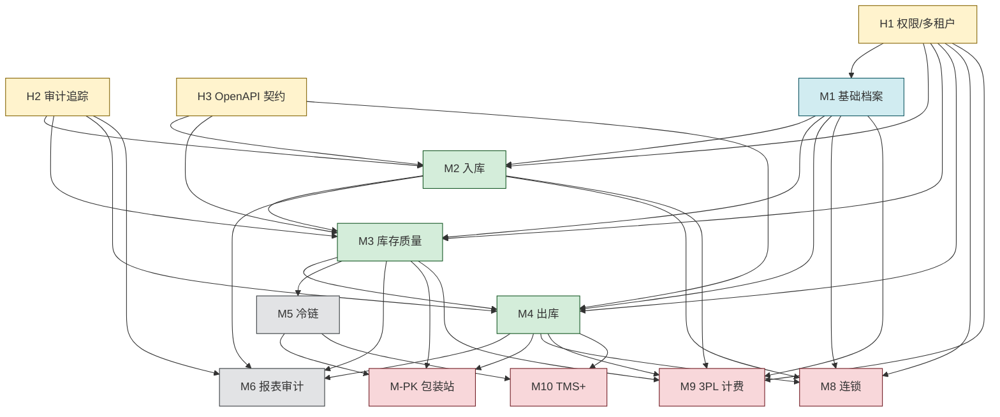

# wms 架构依赖图（Architecture Dependencies）

> 本文档是 wms 项目模块依赖关系的**唯一真相源**。
> ROADMAP 的波次划分、ADR-0007 的执行顺序、worktree 并行决策，都基于本文档。
> 修改本文档必须经过 PR，并同步检查是否需要更新 ADR-0007 与 ROADMAP.md。

- 版本：v0.2
- 日期：2026-05-16
- 关联：`docs/governance.md`、`docs/adr/0007-roadmap-v03-boundary-alignment.md`、`ROADMAP.md`

---

## 1. 模块清单

### 1.1 横向能力（H 层，所有业务模块的基础设施）

| 编号 | 横向能力 | 简称 | 说明 |
|-----|---------|------|------|
| H1 | 权限与多租户（货主隔离） | auth-tenant | 所有 API 鉴权；多货主数据隔离 |
| H2 | 审计追踪基础设施 + 事件总线 | audit-trail | append-only 审计；H2-005 升级为统一事件总线（H-EVT 角色，覆盖审计/业务/系统三类事件） |
| H3 | 跨端契约（OpenAPI + utoipa） | contract | 后端生成 OpenAPI；前端类型同步 |
| H4 | 企业微信通知与审批 | wechat-notify | 通知配置/发送/审批流对接；消息发送通道层 |
| H5 | 快递面单与运单 | express | 配送方路由 + 自有/第三方差异化（详见 user-stories-h5）|
| H6 | 状态机引擎 | state-machine | 多业务模块状态机统一引擎（详见 infra/technical-specs.md）|
| H7 | 导入导出引擎 | import-export | Excel/CSV 数据导入导出统一引擎 |
| H8 | ERP 防腐层 | erp-acl | WMS↔ERP 接口表 + 反馈回写（含档案补录通道）|
| H9 | 打印模板引擎 | print-template | 标签/单据/PDF 台账统一模板引擎 |
| H10 | 数据库备份与恢复 | db-backup | 全量+WAL+异地 + 加密+演练；与 H2 共同保障 GSP 数据完整性（详见 infra/technical-specs.md）|
| **H-DOCK** | **月台预约管理（v3.1 新增）** | **dock-management** | **月台档案 + 预约调度 + 实到对账；可启用开关（默认关闭，3PL/冷链优先仓启用）；GSP 6.83/8.116/9.121** |
| **H-AL** | **告警引擎（v3.1 新增）** | **alert-engine** | **告警分级/升级/生命周期/路由/静默；调用 H4 通道；GSP 5.71 触发响应时间合规** |

### 1.2 业务模块（M 层）

| 编号 | 模块 | 简称 |
|-----|------|------|
| M1 | 基础信息与资质档案 | master-data |
| M2 | 采购入库作业（PDA 集成） | inbound |
| M3 | 库存与质量管控 | inventory |
| M4 | 销售出库作业 | outbound |
| M5 | 冷链数据集成（接收外部冷链系统数据） | cold-chain |
| M6 | 报表与审计追踪 | audit-report |
| ~~M7~~ | ~~零拣复核包装站~~（能力迁移到 M-PK 包装站） | picking-pack |
| M8 | 连锁药店专有 | retail-chain |
| M9 | 3PL 计费管理 | billing |
| M10 | 运输协同（WMS-TMS 集成） | tms-plus |
| ~~M11~~ | ~~监管平台一键对接~~（v7 移除：码上放心迁 M-TC，药监 EDI 由 ERP 做） | regulatory-edi |
| M-TC | 追溯码模块（码库/绑定/核验/**码上放心上报**） | traceability-code |

### 1.3 横向业务能力（M- 前缀）

| 编号 | 模块 | 简称 |
|-----|------|------|
| M-TE | 任务引擎 | task-engine |
| M-RP | 补货 | replenishment |
| M-PK | 包装站（承接原 M7 零拣复核包装能力） | packing-station |
| M-VR | 规则引擎 | validation-rules |
| M-QL | 质量联系单 | quality-liaison |
| M-CG | 编码生成 | code-generator |
| M-SA | 报损报溢 | stock-adjustment |
| M-RC | 对账 | reconciliation |
| M-DI | 药检单 | drug-inspection |
| M-BA | 批号调整 | batch-adjustment |
| M-PM | 参数对照（v24 新增：ERP 不规则字段规整化） | parameter-mapping |

### 1.4 模块依赖图工具化（v3.1 引入，借鉴 Odoo __manifest__.py）

> 参见 [ADR-0008](adr/0008-borrow-from-odoo.md) §4。

每个模块在 `docs/domain/<module-slug>/module-manifest.toml` 声明依赖与启用约束，由治理脚本 `check_module_dependencies.py`（Wave 0+ 待实现）自动构建依赖图，与本文档 §1.1-§1.3 一致性校验。

**示例**：[docs/domain/m-tc/module-manifest.toml](domain/m-tc/module-manifest.toml)

**字段速览**：
- `[module]`：code / name / slug / version / category
- `[depends]`：business / horizontal / external
- `[wave]`：target / parallel_track
- `[stories]`：故事文件路径
- `[data]`：启用时加载的预置数据
- `[lifecycle]`：post_install / pre_uninstall 钩子
- `[gsp]`：相关 GSP 条款 + mandatory_for_china
- `[fields]`：与字段词典关联的关键 canonical

**实施 Wave**：
- Wave 0 末期：补 29 个模块的 manifest（每个 ~30 行）+ 写治理脚本
- Wave 1+：按 manifest 自动加载预置数据 + 启动顺序

---

## 2. 核心路径依赖图

> 本图只展示影响 Wave 顺序的核心路径。完整模块清单见 §1；H6-H10 的消费关系见 `docs/infra/technical-specs.md`。



---

## 3. 分层视图

=== "📊 流程图"

    ```mermaid
    flowchart TD
        L0["第 0 层 横向能力（业务模块的基础设施）<br/>H1 权限/多租户 · H2 审计追踪 · H3 OpenAPI 契约<br/>H4 企业微信 · H5 快递 · H6 状态机 · H7 导入导出<br/>H8 ERP 防腐层 · H9 打印模板 · H10 数据库备份"]
        L1["第 1 层 业务底座<br/>M1 基础档案（商品/供应商/客户/仓库/库位）"]
        L2["第 2 层 核心业务流程（线性依赖：入→存→出）<br/>M2 入库 → M3 库存质量 → M4 出库"]
        L3["第 3 层 横向叠加能力<br/>M5 冷链（叠加在 M3）· M6 报表审计（贯穿 M2/M3/M4）"]
        L4["第 4 层 增值业务<br/>M-PK 包装站 · M8 连锁 · M9 3PL 计费 · M10 TMS+<br/>(M11 监管 EDI 已 v7 移除)"]
        L0 --> L1
        L1 --> L2
        L2 --> L3
        L3 --> L4
        classDef horizLayer fill:#e1f5ff,stroke:#0288d1,stroke-width:2px
        classDef baseLayer fill:#fff3e0,stroke:#f57c00,stroke-width:2px
        classDef coreLayer fill:#f3e5f5,stroke:#7b1fa2,stroke-width:2px
        classDef crossLayer fill:#e8f5e9,stroke:#388e3c,stroke-width:2px
        classDef valueLayer fill:#fce4ec,stroke:#c2185b,stroke-width:2px
        class L0 horizLayer
        class L1 baseLayer
        class L2 coreLayer
        class L3 crossLayer
        class L4 valueLayer
    ```

=== "📝 源码"

    ```
    flowchart TD
        L0["第 0 层 横向能力（业务模块的基础设施）<br/>H1 权限/多租户 · H2 审计追踪 · H3 OpenAPI 契约<br/>H4 企业微信 · H5 快递 · H6 状态机 · H7 导入导出<br/>H8 ERP 防腐层 · H9 打印模板 · H10 数据库备份"]
        L1["第 1 层 业务底座<br/>M1 基础档案（商品/供应商/客户/仓库/库位）"]
        L2["第 2 层 核心业务流程（线性依赖：入→存→出）<br/>M2 入库 → M3 库存质量 → M4 出库"]
        L3["第 3 层 横向叠加能力<br/>M5 冷链（叠加在 M3）· M6 报表审计（贯穿 M2/M3/M4）"]
        L4["第 4 层 增值业务<br/>M-PK 包装站 · M8 连锁 · M9 3PL 计费 · M10 TMS+<br/>(M11 监管 EDI 已 v7 移除)"]
        L0 --> L1
        L1 --> L2
        L2 --> L3
        L3 --> L4
    ```

---

## 4. 关键依赖说明

### 4.1 横向能力（H 层）必须先行的理由

| 能力 | 为什么必须先做 |
|-----|----------------|
| H1 权限/多租户 | 后期补租户化 = 改所有表 + 所有查询，是灾难 |
| H2 审计追踪 | 后期补审计 = 历史数据无法追加审计痕迹，违反 GSP |
| H3 OpenAPI 契约 | 后期补 = 前后端类型已分裂，迁移成本高 |

**结论**：H1 / H2 / H3 必须**最先做**，且不能延后。

### 4.2 业务底座（M1）的渐进性

商品没有就没有库存、入库、出库——**M1 是绝对前置**。
但 M1 内部可以**渐进扩展**，不必一次到位：

- **M1.a** 基础属性（编码、名称、规格） → 立刻能用
- **M1.b** 资质有效期校验 → 入库（M2）时才需要
- **M1.c** UDI / 监管码 → "码上放心"上报（M-TC，Wave 4）时才需要

### 4.3 核心业务流程（M2 → M3 → M4）

强依赖关系，**schema 必须按顺序稳定**：
- M2 入库写 schema 后，M3 才知道怎么读批次
- M3 库存模型定下来后，M4 才能扣减库存

但 **M2 / M3 / M4 的"前端页面"和"PDA 端"可以并行**（schema 定了之后）。

### 4.4 横向叠加（M5 / M6）

| 模块 | 真实依赖 | 并行性 |
|-----|---------|--------|
| M5 冷链数据集成 | M3 库存（按温区控制）+ 外部冷链系统接口 | 必须等 M3 稳定 + 外部对接确认 |
| M6 报表审计 | H2 审计基础设施 + 各业务模块写入审计表 | **可与 M2/M3/M4 并行**（消费方角色，不阻塞业务） |

### 4.5 增值模块（M-PK / M8-M10）

| 模块 | 业务依赖 | 外部依赖（非技术）|
|------|----------|-------------------|
| M-PK 包装站 | M3 + M4 + M5 | 电子秤 / 蓝牙打印机硬件 |
| M8 连锁 | M1 + M4 + H1 | 门店主数据 |
| M9 3PL 计费 | M2/M3/M4 流水 + H1 | 合同条款约定 |
| M10 TMS+ | M4 + M5 | **外部 TMS 系统**（v10 边界：车辆排班/路径规划/在途监控/温控由外部 TMS 主管，WMS 仅做出库订单推送 + 调度结果接收） |

### 4.6 ~~M11 的特殊提示~~（v7 移除）

> 原 M11 监管 EDI 模块经业务边界确认后整体移除：
> - "码上放心"追溯码核销 → 迁移到 M-TC-007
> - 药监局非现场监管 EDI → 由 ERP 负责，WMS 仅通过 H8 防腐层反馈数据给 ERP
> - 不再需要 WMS 自行申请药监局接口资质
> 详见 docs/domain/clarifications.md "监管接口边界"决策。

---

## 5. 波次（Wave）划分

按当前模块清单与 ADR-0007，将业务模块、横向业务能力、横向技术能力分为 **5 个波次**。每波之内可用 worktree 并行；每波之间存在严格依赖。

### Wave 0：治理骨架（已完成或进行中）

不属于业务模块，但必须先于一切代码：
- 项目结构、Git、文档、ADR、治理脚本骨架

### Wave 1：横向底座（H 层）

| 编号 | 任务 | 可并行（worktree）|
|-----|------|------|
| W1.A | H1 权限/多租户基础 | ✅ |
| W1.B | H2 审计追踪基础设施 | ✅ |
| W1.C | H3 OpenAPI 契约工具链（utoipa + gen-api） | ✅ |

H1 / H2 / H3 三者完全独立，可同时进行。**Wave 1 完成是后续所有业务模块的前置条件。**

### Wave 2：业务底座 + schema 先行

| 编号 | 任务 | 依赖 | 可并行 |
|-----|------|------|--------|
| W2.A | M1.a 基础档案 schema + 基础 CRUD（含包装层级/物理属性/特殊药品分类） | H1, H3, W2.E | ✅（W2.E 之后）|
| W2.B | M2 入库 schema 设计（不写业务规则） | H1, H2 | ✅ |
| W2.C | M6 报表查询接口骨架 | H2 | ✅ |
| W2.D | M-TC 追溯码模块（码库/分类/绑定/商品映射） | H1, W2.A | ✅（W2.A 之后） |
| W2.E | **M-PM 参数对照模块**（v24 新增）：字典定义 + 映射规则配置 + 待映射队列 + 执行 API + 反向追溯 | H1, H8 | ✅（与 W2.B / W2.C 并行）|

W2.D 依赖 W2.A（商品档案），但可与 W2.B/W2.C 并行。
W2.E 必须在 W2.A 之前（M1 商品档案接收 ERP 不规则字段时调用 M-PM），与 W2.B / W2.C 并行不冲突。

### Wave 3：核心业务规则铺开

| 编号 | 任务 | 依赖 |
|-----|------|------|
| W3.A | M2 入库业务规则 + handler + PDA 端 | W2.A, W2.B |
| W3.B | M3 库存模型 + 业务规则 | W2.A, W2.B |
| W3.C | M5 冷链 schema 设计 | 独立（不依赖 M3 业务规则）|
| W3.D | M9 3PL 计费"账户/合同"模型 | H1（独立）|

### Wave 4：完整闭环 + 横向叠加

| 编号 | 任务 | 依赖 |
|-----|------|------|
| W4.A | M4 出库（订单/拣选/复核/打印） | W3.B |
| W4.B | M5 冷链业务规则 | W3.B, W3.C |
| W4.C | M6 报表实现（消费各业务流水） | W3.A, W3.B, W4.A |
| W4.D | M-TC 码上放心平台上报 | W2.D, W3.A, W4.A |
| W4.E | H-Driver / H-Store 主动故事落地 | W4.A, H1 |
| W4.F | M-PK 包装站基础能力 | W3.B, W4.A, W4.B |

### Wave 5：增值模块全面铺开

| 编号 | 任务 | 依赖 |
|-----|------|------|
| W5.A | M-PK 包装站增强（电子秤/打印/复杂合箱） | W4.F |
| W5.B | M8 连锁专有 | W2.A, W4.A |
| W5.C | M9 3PL 计费业务规则 | W3.A, W3.B, W4.A, W3.D |
| W5.D | M10 TMS+ | W4.A, W4.B |

**注意**：Wave 5 理论上 4 个 worktree 可同时并行。**实际个人节奏建议最多 3 个并行**，避免认知负荷过载。

---

## 6. 并行约束规则（worktree 落地）

1. **同 Wave 内允许并行**：依据上表 W*.A / W*.B / W*.C 的标记
2. **跨 Wave 不允许并行**：低 Wave 未完成时，高 Wave 不得启动
3. **个人 worktree 上限 = 3**（含 main）
4. **schema 变更必须串行**：同一表的 schema 不允许多个 worktree 并行修改
5. **worktree 命名约定**（关联未来 ADR-0005 worktree 工作流）：
   ```
   wms              → main
   wms-w1a-auth     → Wave 1 worktree A：H1
   wms-w3b-inv      → Wave 3 worktree B：M3
   ```
6. **完成一个 Wave 必须做 retro**：评估实际依赖与图是否一致；不一致时更新本文档

---

## 7. 风险地图

| 风险 | 关联模块 | 缓解 |
|------|---------|------|
| H1/H2/H3 设计错误 | 影响所有业务 | Wave 1 完成后做架构评审，再开 Wave 2 |
| M3 库存模型不稳定 | 阻塞 M4/M5/M6/M-PK/M9 | M3 必须先做"最小可用模型"，复杂特性渐进 |
| ~~M11 外部资质未就位~~（v7 移除）| — | M11 已整体移除，药监 EDI 由 ERP 负责 |
| 外部系统对接延期 | M5（外部冷链）/ M10（外部 TMS）/ M-TC（码上放心）| Wave 启动前确认外部系统选型与接口契约；先用 mock 数据开发 |
| 硬件采购延期 | M-PK（电子秤/蓝牙打印机） | 提前做 SOW，先用 mock 数据开发 |
| 跨 Wave 私自并行 | 失控、返工 | 治理脚本约束 + retro 必查 |

---

## 8. 与其他文档的关系

```
docs/architecture-dependencies.md（本文档，依赖唯一真相源）
  ├─→ docs/adr/0007-roadmap-v03-boundary-alignment.md （当前波次路线决策）
  ├─→ ROADMAP.md                          （用户视角的简版）
  ├─→ TODO.md                             （当前 Wave 的具体任务）
  └─→ governance/gate-rules.toml          （未来 worktree / Wave 的治理规则）
```

---

## 9. 变更记录

| 日期 | 版本 | 变更 |
|------|------|------|
| 2026-05-16 | v0.2 | 对齐 ADR-0007：M11 移除；M-TC 承接码上放心；M-PK 承接原 M7；补齐横向业务能力清单 |
| 2026-05-15 | v0.1 | 初版：11 个业务模块 + 3 个横向能力，5 波次划分 |
| 2026-05-17 | v0.3 | v24 新增 M-PM 参数对照模块（Wave 2 W2.E）；M1.a 依赖关系增 W2.E |
| 2026-05-18 | v3.1 | 横向能力 10 → 12：新增 H-DOCK 月台预约（可启用开关）+ H-AL 告警引擎（GSP 5.71 触发响应时间合规）；H2-005 升级为通用事件总线（覆盖 H-EVT 角色）；M-PM 加 US-MPM-006 交易类型字典管理（PIX 三码） |
