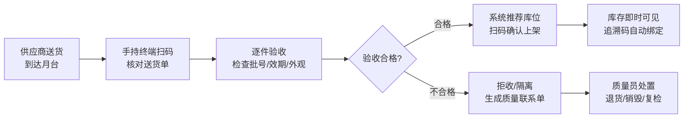
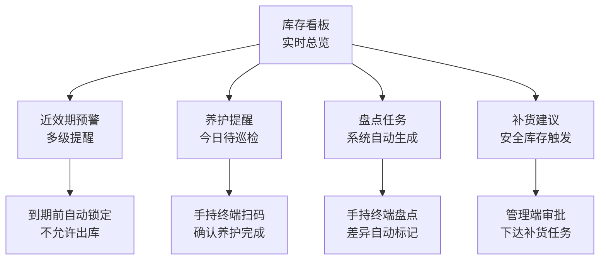
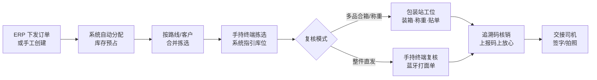
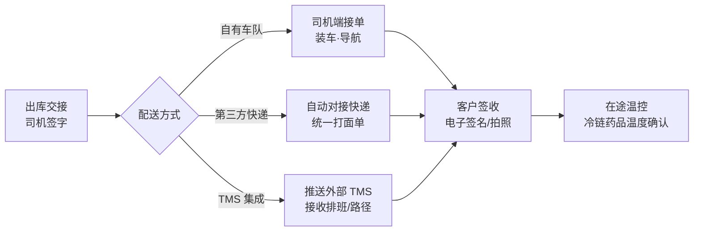
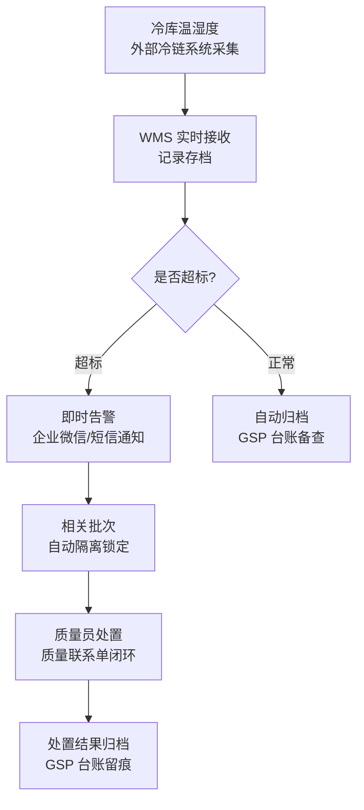
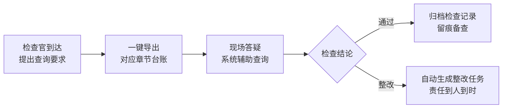
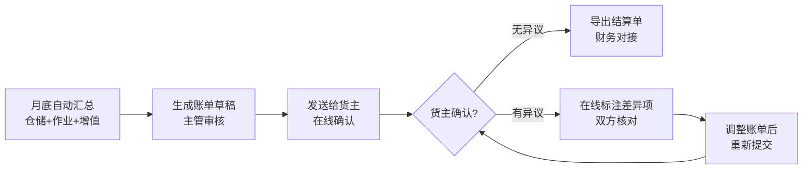
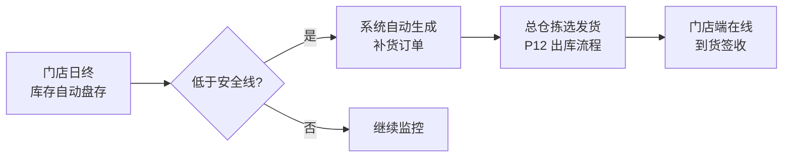
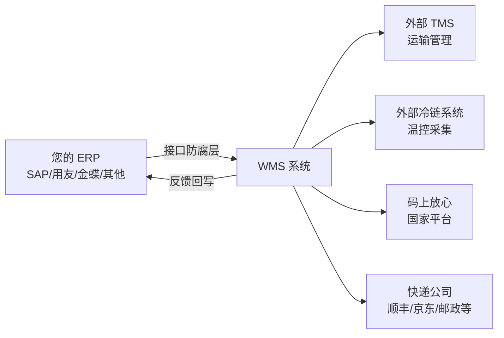
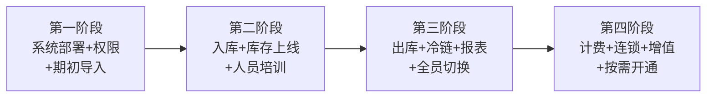

# 医药冷链 GSP 合规仓储管理系统 · 系统蓝图

> 本文档为 PPT 蓝图的 Markdown 大纲稿，每个 `##` 对应一页幻灯片。
> 视角：客户/业务方（系统能为我做什么、我怎么用、怎么落地）。

---

## P1 · 封面

**医药冷链 GSP 合规仓储管理系统**

系统蓝图

- 三端协同 · GSP 全流程合规 · 多货主原生支持

---

[版本：v1.0 · 日期：2026-05 · 为 [客户名称] 准备]

---

## P2 · 目录

**A 产品概览**
| # | 章节 | 页 |
|---|------|---|
| 01 | 系统全景 | P3 |
| 02 | 项目价值 | P4 |
| 03 | 为什么选我们 | P5 |
| 04 | 团队与资质 | P6 |
| 05 | 角色与使用终端 | P7 |

**B 核心能力**
| # | 章节 | 页 |
|---|------|---|
| 06 | 入库作业 | P8-P9 |
| 07 | 库存与质量管理 | P10-P11 |
| 08 | 出库作业 | P12-P13 |
| 09 | 运输与配送 | P14 |
| 10 | 冷链管控 | P15 |
| 11 | GSP 合规与报表 | P16 |
| 12 | 3PL 计费与对账 | P17 |
| 13 | 连锁门店协同 | P18 |
| 14 | 与现有系统集成 | P19 |
| 15 | 运营驾驶舱 | P20 |
| 16 | 数据大屏样例 | P21 |

**C 实施服务**
| # | 章节 | 页 |
|---|------|---|
| 17 | 部署形态与数据安全 | P22 |
| 18 | 系统可用性与故障应急 | P23 |
| 19 | 实施上线计划 | P24 |
| 20 | 数据准备 | P25 |
| 21 | 培训计划 | P26 |

**D 商务参考**
| # | 章节 | 页 |
|---|------|---|
| 22 | 行业适用性 | P27 |
| 23 | 投资回报参考 | P28 |
| 24 | 客户常见疑问 | P29 |
| 25 | 总结 | P30 |
| — | 结尾 | P31 |

---

## P3 · 01 系统全景

> 基于多端响应式架构，覆盖仓库全部日常作业

**多端 × 业务域 × 角色矩阵**：

| 业务域 | 主要角色 | 管理端（PC/平板） | 仓内作业终端 | 手机端 |
|--------|---------|----------|-----------|--------|
| 基础档案 | 主管 / 质量 | 商品 · 供应商 · 客户 · 仓库 · 库位 | — | — |
| 入库 | 收货 / 质量 | 到货预报 · 验收审批 | 手持终端：扫码收货 · 上架 | — |
| 库存 | 主管 / 养护 / 盘点 | 库存查询 · 盘点 · 养护计划 | 手持终端：盘点 · 养护 | — |
| 出库 | 拣货 / 复核 / 包装 | 订单 · 拣选策略 · 单据 | 手持终端：拣选；包装站：装箱 · 称重 · 贴单 | — |
| 冷链 | 主管 / 质量 | 温控台账 · 超标告警 | — | — |
| 报表 | 主管 / 货主 | GSP 法定台账 · 运营看板 | — | — |
| 质量 | 质量 | 质量联系单 · 药检 · 报损报溢 | 手持终端：质量抽检 | — |
| 连锁 | 主管 / 拣货 / 门店 | 门店管理 · 自动补货 | 手持终端：越库分拣 | 门店端：订单 · 签收 |
| 计费 | 主管 / 货主 | 合同 · 月结账单 · 对账 | — | — |
| 运输 | 主管 / 司机 | 月台预约 · 运输协同 | — | 司机端：配送 · 签收 |
| 追溯 | 收货 / 复核 | 码上放心 · 追溯码管理 | 手持终端：扫码核验；包装站：装箱核验 | — |

> 角色列采用简称（主管=仓库主管，质量=质量员，收货/拣货/复核/包装/养护/盘点=对应作业员）；详细角色定义见 P7。

> 说明：PC 与平板共用一套界面（响应式）；仓内作业终端含手持扫码终端 + 包装站工位（PC + 电子秤 + 打印机）。

[界面示意占位：系统主界面 + 多端协同截图]

---

## P4 · 02 项目价值

> 基于全流程数字化，实现从手工台账到智能仓储的跃迁

| 维度 | 上线前（手工/旧系统） | 上线后 |
|------|-------------------|--------|
| 收货 | 纸质单据、手工录入、易出错 | 手持扫码、自动校验、单据电子化 |
| 库存管理 | Excel 台账、人工盘点、数据滞后 | 实时库存、自动预警、扫码盘点 |
| 出库 | 人工找货、手写单据、易发错 | 系统指引拣选、逐件复核防错 |
| 冷链 | 人工抄温度、夜间无人管控 | 24 小时自动监控、超标即时告警 |
| GSP 迎检 | 翻箱倒柜找记录、手工整理 | 一键导出台账、全程可追溯 |
| 对账 | 手工统计、来回核对 | 自动计费、在线对账 |
| 运营效率 | 数据滞后、靠经验 | 收货 / 拣选 / 盘点显著提速* |

*实际提效幅度以现场基线测算为准。同行业典型场景见 P27 行业适用性。

---

## P5 · 03 为什么选我们

> 基于医药专精设计，构筑 GSP 合规的开箱即用底座

| # | 差异化 | 说明 |
|---|--------|------|
| 1 | **医药 GSP 专精** | 不是通用 WMS 改装，从设计起即贴合 GSP 法规（第 5-10 章 + 特殊药品专项） |
| 2 | **审计追踪不可篡改** | 所有操作记录只能追加、不能修改/删除（append-only），满足 GSP 数据完整性要求 |
| 3 | **特殊药品强制双人** | 麻精/毒性/放射性药品系统强制双人双锁验收，从源头防止单人操作风险 |
| 4 | **码上放心已对接** | 内置追溯码模块，入库自动绑定、出库自动核销、实时上报国家平台 |
| 5 | **多货主 · 多端 · 离线（基础设施三件套）** | 多货主数据隔离 + 多端实时协同 + 手持终端离线作业，从底层设计支持，不是补丁 |

> 5 项支柱共同构成医药 WMS 的合规底座，开箱即用。

---

## P6 · 04 团队与资质

> 基于深度行业沉淀，提供从软件到合规的全周期保障

**团队**：
- [团队规模 / 成立时间由销售团队补充]
- 核心成员涵盖医药 GSP 业务专家 + 仓储信息化资深工程师
- 服务过医药批发 / 连锁药店 / 第三方物流多类客户

**资质与认证**：
- [软件著作权清单由销售团队补充]
- [ISO27001 / CMMI 等资质由销售团队补充]
- [GSP / GMP 行业相关合作伙伴资质]

**持续保障**：
- 持续跟踪 GSP 法规变更，标准合规更新随版本免费下发
- 7×12 技术支持 + 7×24 系统监控
- 上线后 30 天驻场陪跑

> 详细团队与资质材料可由销售团队当面提供。

---

## P7 · 05 角色与使用终端

> 基于精细化角色权限，让每个岗位只看到自己需要的功能

| 角色 | 使用终端 | 主要功能 |
|------|---------|---------|
| 仓库主管 | 管理端（PC/平板） | 计划排班 · 审批 · 报表 · 异常处理 |
| 质量员 | 管理端（PC/平板） | 验收审核 · 养护 · 质量联系单 · 药检 |
| 收货员 | 手持扫码终端 | 扫码收货 · 验收 · 上架 |
| 拣货员 | 手持扫码终端 | 拣选任务 · 扫码确认 |
| 复核/包装员 | 包装站 / 手持扫码终端 | 包装站：复核 · 装箱称重 · 贴单；整件直发：手持终端复核 |
| 盘点员 | 手持扫码终端 | 盘点扫码 · 差异录入 |
| 养护员 | 手持扫码终端 | 养护巡检 · 温湿度确认 |
| 货主 | 管理端（PC/平板） | 查看本货主库存 · 账单确认 · 对账 |
| 门店用户 | 手机端 | 订单查询 · 到货签收 |
| 司机 | 手机端 | 配送任务 · 签收 · 温度确认 |
| 系统管理员（IT 运维） | 管理端（PC） | 用户/角色管理 · 备份恢复 · 监控告警 |

---

## P8 · 06 入库作业 — 全流程

> 基于 PDA 全流程扫码，实现验收-上架-追溯一次完成

**收货员日常**：
1. 打开手持终端 → 看到今日待收货清单
2. 供应商到货 → 扫码核对品种、数量、批号
3. 验收合格 → 系统告诉他放哪个货架
4. 扫码确认上架 → 完成，库存实时更新

> 月台预约能力详见 P14 运输与配送。

[界面示意占位：手持终端收货任务列表 + 验收界面]

---

## P9 · 06 入库作业 — 关键场景

> 基于规则引擎前置校验，防止异常入库流入下游

| 场景 | 系统处理方式 |
|------|------------|
| 数量不符 | 自动生成差异报告，通知仓库主管审批 |
| 冷链药品到货 | 验收时强制录入到货温度，未录入不可继续 |
| 特殊药品（麻精/毒性/放射性） | 强制双人验收，系统校验两人签字 |
| 供应商资质过期 | 系统自动拦截，不允许入库 |
| 批号已存在 | 自动合并到同批次库存 |
| 月台拥堵 | 供应商提前预约时段，系统自动排期 |

---

## P10 · 07 库存与质量管理 — 看板

> 基于实时数据汇总，让主管一屏掌握全库动态

**仓库主管每天打开系统看到**：
- 今日库存异动汇总
- 近效期药品预警清单（剩余天数、所在库位）
- 今日待养护品种
- 待审批的补货建议
- 待处理的盘点差异

[界面示意占位：管理端库存看板大图]

---

## P11 · 07 库存与质量管理 — 关键场景

> 基于规则引擎自动处置，让异常状态秒级闭环

| 场景 | 系统处理方式 |
|------|------------|
| 药品近效期 | 多级预警（剩余天数阈值按药品类别可配置），临近到期自动锁定不可出库 |
| 养护到期 | 自动推送养护任务到手持终端，逾期升级告警 |
| 盘点差异 | 差异自动生成报损/报溢单，走审批流 |
| 货主查库存 | 数据隔离，每个货主只看到自己的货 |
| 批号变更 | ERP 同步过来自动更新，保留完整变更轨迹 |
| 质量问题 | 一键锁定批次，生成质量联系单走处置流程 |

---

## P12 · 08 出库作业 — 全流程

> 基于波次合并 + FIFO + 复核防错，显著降低订单出仓差错率

**拣货员日常**：
1. 打开手持终端 → 看到今日拣选任务
2. 系统告诉他：去 A-03-02 货架，拿 XX 药品 5 盒
3. 扫码确认拣选 → 系统自动指引下一个库位

**复核/包装员日常（包装站）**：
1. 包装站屏幕显示本单应有品种和数量
2. 逐件扫码核对 → 电子秤自动称重比对
3. 装箱后贴运单面单 → 系统自动核销追溯码

**整件直发场景**：
- 拣货员在手持终端直接扫码复核 + 蓝牙打印面单
- 免去前往包装站，提升效率

---

## P13 · 08 出库作业 — 关键场景

> 基于多场景路径分支，覆盖整件直发到合箱发货

| 场景 | 系统处理方式 |
|------|------------|
| 库存不足 | 自动提示缺货，支持部分发货 + 欠货单 |
| 先进先出 | 系统强制按批次先入先出分配，人工不可跳过 |
| 冷链药品出库 | 根据保温箱配置规则提示冷媒数量与摆放方案 |
| 门店经营范围外 | 系统自动拦截，不允许发超范围品种 |
| 退货 | 原批号追溯 → 质量复检 → 合格回库/不合格销毁 |
| 打印单据 | 随货同行单、发票、面单一键打印 |

---

## P14 · 09 运输与配送

> 基于自有车队 + 外部对接的双轨设计，确保最后一公里

**月台管理（双向预约）**：
- 入库：供应商提前预约到货时段，避免月台拥堵
- 出库：承运商提前预约提货时段，自动排期
- 实到时间自动对账，超时告警

**司机端（手机）**：
- 今日配送任务清单 · 导航到客户地址
- 客户签收（电子签名/拍照）
- 冷链药品到货时确认保温箱温度

---

## P15 · 10 冷链管控 — 全程温控

> 基于 24 小时温控数据接入，实现温度异常的告警-隔离-处置全闭环

**您不需要**：
- 手动抄温度记录
- 人工巡检怕遗漏
- 担心夜间无人值守温度异常
- 人工统计冷链台账迎检

**系统帮您**：
- 24 小时自动记录
- 超标即时通知到手机
- 问题批次自动锁定，降低误发风险
- 监管检查时一键导出完整记录

---

## P16 · 11 GSP 合规与报表

> 基于法规章节映射 + 不可篡改审计，让 GSP 迎检从被动到从容

**法规覆盖范围**：

| GSP 章节 | 系统支持 |
|---------|---------|
| 第 5 章 质量管理体系 | 角色权限 · 审计追踪 · 制度执行留痕 |
| 第 6 章 采购与验收 | 供应商资质 · 双人验收 · 验收记录 |
| 第 7 章 储存与养护 | 库位温区 · 养护计划 · 近效期预警 |
| 第 8 章 销售与出库 | 经营范围校验 · 复核 · 随货同行单 |
| 第 9 章 冷链专项 | 温湿度全程记录 · 超标处置闭环 |
| 第 10 章 追溯与不合格品 | 追溯码 · 销毁记录 · 不合格品处置 |
| 特殊药品专项 | 麻精/毒性/放射性双人双锁 · 分级保留 |

**法定台账（一键生成）**：购进 · 验收 · 养护 · 销售 · 销毁 · 退货 · 温湿度监测 · 不合格品处置

> 数据保留期限与备份策略详见 P22 数据安全。

---

## P17 · 12 3PL 计费与对账

> 基于多维度自定义计费规则，覆盖多货主合同的全部场景

**计费方式**：

| 费用类型 | 计费规则 | 举例 |
|---------|---------|------|
| 仓储费 | 库位数 × 天数 × 单价 | A 货主占 50 库位 × 30 天 |
| 入库操作费 | 入库笔数/件数 × 单价 | 本月入库 200 单 |
| 出库操作费 | 出库笔数/件数 × 单价 | 本月出库 500 单 |
| 增值服务费 | 按实际发生量 | 贴标 100 件 |

**计费规则可配置**：每个货主独立合同；按温区/品类/SKU 多维度自定义。

---

## P18 · 13 连锁门店协同

> 基于安全库存自动触发 + 经营范围管控，构建总仓-门店敏捷协同

**门店用户看到**：
- 我的订单（在途/已到/历史）
- 到货确认（扫码签收）
- 库存查询（本店可用库存）

**经营范围管控**：
- 每个门店配置可经营品种范围
- 超范围品种系统自动拦截

**越库作业**（紧急品种到货后不入库，直接分拣配送到门店）

---

## P19 · 14 与现有系统集成

> 基于接口防腐层设计，让现有系统无需改动平滑对接

**集成范围**：
- **ERP 对接**：商品档案/采购订单/销售订单/库存回写自动同步（通过接口防腐层屏蔽 ERP 差异）
- **外部冷链系统**：实时接收温湿度数据，触发业务联动
- **运输管理（TMS）**：推送出库订单，接收车辆排班/路径/在途温控
- **码上放心**：追溯码核销实时上报国家平台
- **快递公司**：自动对接面单打印（顺丰/京东/邮政等主流快递）
- **企业微信**：审批流/告警通知/作业提醒推送
- **财务/银企**：财务核算由 ERP 主导，WMS 推送计费明细给 ERP，避免重复对账

**对接成本由现场调研后给出方案，原则是您现有系统不动，由 WMS 适配。**

---

## P20 · 15 运营驾驶舱

> 基于全数据汇聚，让经营决策从经验走向数据

**驾驶舱总览**：

| 大屏主题 | 主要看什么 | 主要看什么人 |
|---------|---------|------------|
| **库存全景一张图** | 货主/品类/温区/批次状态分布 | 仓库主管 · 货主 |
| **冷链温控一张图** | 所有冷库实时温度热力图 + 超标历史 | 主管 · 质量员 |
| **今日作业一张图** | 入库/拣选/盘点/出库进度与吞吐 | 主管 · 一线班组长 |
| **异常告警一张图** | 近效期/超标/差异/逾期养护汇总 | 主管 · 质量员 |
| **多仓协同一张图** | 多仓库存联动 + 调拨 + 连锁门店覆盖 | 多仓集团客户 |
| **货主独立看板** | 货主自助查看：本货主库存/账单/SLA | 货主 |

**驾驶舱关键能力**：
- 实时刷新（秒级数据）
- 钻取下钻（点击数据看明细）
- 多端展示（PC 大屏/平板移动看板/手机推送）
- 角色化定制（不同角色看不同关注点）
- 历史回放（任意时点状态回溯）

[界面示意占位：6 类驾驶舱缩略图拼贴]

---

## P21 · 16 数据大屏样例

> 基于实时大屏可视化，让管理者随时掌握业务脉搏

**样例 1：库存全景一张图**
- 货主分布饼图 + 温区分布柱图 + 近效期预警 Top10
- 异常状态库存（待检/不合格/锁定）Top 列表
- 大屏适配（4K / 双屏 / 平板）

**样例 2：冷链温控一张图**
- 仓库平面图叠加温度热力图（实时着色）
- 各冷库温度曲线（24h / 7d / 30d）
- 超标事件时间轴 + 处置状态
- 告警通知历史

**样例 3：今日作业一张图**
- 进度仪表盘（入库进度 / 拣选完成率 / 复核率 / 出库率）
- 班组排行（人均处理量 / 准时率 / 差错率）
- 吞吐趋势（今日 vs 历史均值）

**样例 4：异常告警一张图**
- 异常类型分布（近效期 / 超标 / 差异 / 逾期养护）
- 处置时效统计（已处置 / 处置中 / 待处置）
- 责任人催办列表

**样例 5：多仓协同一张图**
- 全国仓库点位地图
- 仓间调拨流向 + 库存协同
- 连锁门店覆盖范围（GIS 网格）

**样例 6：货主独立看板**
- 本货主库存（按品类/温区/批次状态）
- 本货主月度账单 + 计费明细 + 历史对账
- 本货主 SLA 指标（订单准时率/温度合格率/差错率）
- 自助查询：库存/在途/历史订单

[界面示意占位：6 张大屏样例 mockup 拼贴]

---

## P22 · 17 部署形态与数据安全

> 基于多形态部署 + 多层备份，让数据安全可控

**部署形态（可选）**：

| 形态 | 说明 | 适用场景 |
|------|------|---------|
| 私有化部署 | 服务器部署在客户机房或专属云 | 数据完全自主可控 |
| 托管部署 | 由我方提供专属云资源 | 客户无需运维 |
| 容器化交付 | 标准 Docker / Kubernetes 镜像 | 一次部署多环境复用 |

**数据安全**：

| 措施 | 说明 |
|------|------|
| 实时备份 | 数据库 WAL 实时增量备份，可恢复到任意时刻 |
| 全量备份 | 每日全量备份，保留至少 30 天 |
| 异地容灾 | 备份数据异地存储，单点故障不丢数据 |
| 加密存储 | 敏感数据加密；备份文件加密 |
| 操作审计 | 所有数据变更留痕，追溯到人 |
| 合规保留 | 业务数据 ≥ 5 年（特殊药品按法规延长） |
| 数据可导出 | 业务数据/审计/台账标准格式（Excel/CSV/PDF）导出，数据所有权归您所有 |

---

## P23 · 18 系统可用性与故障应急

> 基于高可用部署 + 离线作业 + 应急预案，让仓库作业最大限度连续运行

**系统可用性**：

| 措施 | 说明 |
|------|------|
| 高可用部署 | 应用/数据库双节点，单点故障自动切换 |
| 离线作业 | 仓库 WiFi 不稳定时手持终端自动切换离线模式，恢复后自动同步 |
| 7×24 监控 | 系统全链路监控，异常自动告警值班团队 |
| SLA | 服务可用性以合同 SLA 条款为准 |

**故障应急流程**：

**业务连续性保障**：
- 应急单模板预先下发到每个工作站
- 关键岗位有"无系统作业"备用 SOP
- 系统恢复后差异条目走审批流核销

---

## P24 · 19 实施上线计划

> 基于分阶段交付，让业务边用边迭代

| 阶段 | 内容 | 您需要配合 |
|------|------|-----------|
| **第一阶段** | 系统部署 · 基础数据导入 · 权限配置 | 提供商品/供应商/客户/仓库基础数据 |
| **第二阶段** | 入库 + 库存上线 · 人员培训 | 安排人员参加培训 · 试运行反馈 |
| **第三阶段** | 出库 + 冷链 + GSP 报表上线 | 全员切换使用 · 旧系统并行过渡 |
| **第四阶段** | 计费 + 连锁 + 增值功能 | 按需开通模块 |

**分批上线**：每个阶段完成后对应业务即可独立使用，不必等所有阶段完成。具体时间表以现场调研后的项目计划为准。

---

## P25 · 20 数据准备

> 基于标准模板 + 现场协同，让数据迁移省时省力

| 数据类型 | 内容 | 格式 | 提供时机 |
|---------|------|------|---------|
| 商品档案 | 编码/名称/规格/厂家/储存条件/批准文号 | Excel 导入 | 第一阶段启动前 2 周 |
| 供应商档案 | 名称/资质证照/有效期 | Excel + 证照扫描件 | 第一阶段启动前 2 周 |
| 客户/门店 | 名称/地址/经营范围 | Excel 导入 | 第一阶段启动前 2 周 |
| 仓库/库位 | 库区划分/库位编码/温区类型 | 现场测绘 + Excel | 第一阶段启动前 1 周 |
| 期初库存 | 品种/批号/效期/数量/库位 | Excel 导入 | 切换日 -3 天（最终盘点后） |
| 计费合同 | 各货主计费规则 | 合同扫描 + 系统配置 | 第四阶段启动前 1 周 |

**旧系统数据迁移**：

| 类型 | 处理方式 |
|------|---------|
| 现有库存 | 切换日盘点后导入期初 |
| 历史业务数据（订单/流水） | 在旧系统归档查询，不迁入 WMS（避免数据脏污） |
| 历史温控记录 | 按 GSP 法规要求归档保留 ≥ 5 年，可由 WMS 提供查询入口 |
| 资质证照扫描件 | 上传至 WMS 附件库，过期自动预警 |

---

## P26 · 21 培训计划

> 基于角色化培训 + 长期陪跑，让团队从生疏到熟练

| 培训对象 | 培训内容 | 时长 | 方式 |
|---------|---------|------|------|
| 仓库主管 | 系统全功能 · 审批流 · 报表 · 异常处理 | 2 天 | 现场 + 操作手册 |
| 质量员 | 验收 · 养护 · 质量联系单 · 台账导出 | 1 天 | 现场 |
| 收货/拣货/盘点员 | 手持终端操作（扫码作业） | 半天 | 现场实操 |
| 复核/包装员 | 包装站操作 · 称重 · 装箱 · 贴单；整件直发用手持终端复核 | 半天 | 现场实操 |
| 货主 | 库存查询 · 账单确认 | 1 小时 | 远程 |
| 门店用户 | 订单查询 · 签收确认 | 30 分钟 | 远程/视频 |
| 司机 | 手机端配送 · 签收 · 温度确认 | 30 分钟 | 远程/视频 |
| 系统管理员（IT 运维） | 用户/角色 · 备份恢复 · 监控告警 · 升级流程 | 1 天 | 现场 + 运维手册 |

**培训保障**：
- 现场首周驻场支持
- 7×12 小时技术支持热线
- 操作手册（中文图文版）+ 视频教程
- 上线 30 天内不限次数追加培训

---

## P27 · 22 行业适用性

> 基于不同业务模式的差异化能力，匹配多元医药客户需求

| 客户类型 | 典型场景 | 系统亮点对应 |
|---------|---------|------------|
| 区域龙头医药批发企业 | 多货主、3PL、ERP 对接、GSP 检查频繁 | 多货主隔离 + 计费 + 审计追踪 |
| 全国连锁药店 | 总仓 + 数百门店、自动补货、O2O | 连锁补货 + 经营范围管控 + 越库作业 |
| 冷链专业仓 | 疫苗、生物制品、血液制品 | 24h 温控 + 超标处置 + 分级保留 |
| 监管对接需求企业 | 麻精/毒性/放射性、码上放心上报 | 双人双锁 + 追溯码全链路 |
| 第三方医药物流 | 多货主合同、分仓协同、运输对接 | 多租户 + 计费 + TMS 集成 |
| 医药商业 + 工业一体 | 自营 + 代储代运、原辅料管理 | 货主独立计费 + 多业务模式 |

> 具体客户案例由销售团队当面提供。

---

## P28 · 23 投资回报参考

> 基于多维收益叠加，构建可量化的投资回报路径

| 收益维度 | 来源 | 客户回报 |
|---------|------|---------|
| **降本** | 减少人工抄录、人工盘点、人工对账 | 仓库人力成本下降 |
| **提效** | 智能拣选/复核/上架/盘点 | 单仓吞吐量提升 |
| **降错** | 系统强制 FIFO + 复核防错 + 经营范围校验 | 发错货/过期作废显著减少 |
| **避险** | GSP 全流程合规 + 审计追踪 | 监管处罚风险降至最低 |
| **客户体验** | 订单准时率/温度合格率/电子签收 | 客户满意度提升、续约率提升 |
| **数据资产** | 全程数据沉淀 + 运营驾驶舱 | 业务决策从经验驱动转数据驱动 |

**典型投资构成**：
- 软件许可（一次性 / 订阅）
- 硬件配置（PDA、电子秤、打印机等）
- 实施服务（部署、数据迁移、培训）
- 持续维保（运维、升级、合规跟踪）

**投资回收**：测算由售前团队为您单独评估，结合您的业务量 / 现有成本基线 / 系统投入 / 硬件配置 综合给出。

---

## P29 · 24 客户常见疑问

> 基于客户高频疑问，提供透明的购前答疑

| Q | A |
|---|---|
| **服务器是 SaaS 还是本地部署？** | 都支持。私有化部署、托管部署、容器化交付（Docker / K8s）三种形态可选 |
| **多久能上线？** | 分阶段上线，每阶段完成后对应业务即可使用；具体时间表现场调研后给出 |
| **培训完员工不会用怎么办？** | 上线 30 天不限次数追加培训 + 7×12 小时技术支持 + 现场首周驻场 |
| **以后想换厂商，数据带得走吗？** | 所有数据支持标准格式（Excel/CSV/PDF）导出，数据所有权归您所有 |
| **升级要不要停机？** | 滚动升级支持热切换，关键业务不中断；重大升级提前预约维护窗口 |
| **二次开发收费吗？** | 标准模块免费配置；定制开发按工作量评估，纳入合同 |
| **GSP 法规更新怎么办？** | 持续跟踪法规变更，标准合规更新随版本免费下发 |
| **服务器要多少配置？** | 根据业务量推荐三档配置（小型/中型/大型仓），现场调研给出方案 |
| **WiFi 不稳定能用吗？** | 手持终端支持离线模式，断网继续作业，恢复后自动同步 |
| **能与现有 ERP 对接吗？** | 内置接口防腐层，已支持主流 ERP（SAP/用友/金蝶等）；其他 ERP 通过标准 API 适配 |

---

## P30 · 25 总结

> 系统为您构建的核心价值

| 价值 | 对应能力 |
|------|---------|
| 一套合规底座 | GSP 第 5-10 章全覆盖（P16）+ 数据 5 年保留 + 审计不可篡改（P22）|
| 一组作业工具 | 入库/库存/出库 PDA + 包装站全覆盖（P8-P13）|
| 一个数据中枢 | 库存/订单/温控实时可见（P10）+ 多端协同（P3）|
| 一组合规台账 | 8 类 GSP 法定台账一键导出（P16）|
| 一面运营大屏 | 6 类驾驶舱 + 5 张数据大屏（P20-P21）|
| 一份长期承诺 | 法规跟踪 · 系统升级 · 持续维保（P26, P29）|

**与您一起建设的事**：
- 流程梳理：现场调研 + 业务标准化建议
- 数据治理：基础档案/编码体系优化建议
- 合规体系：贴合最新 GSP 法规版本
- 长期伙伴：上线不是终点，是合作起点

---

## P31 · 谢谢

**医药冷链 GSP 合规仓储管理系统**

*让每一盒药品的流转都有迹可循*

---

详情请联系 商务团队 / 售前团队
